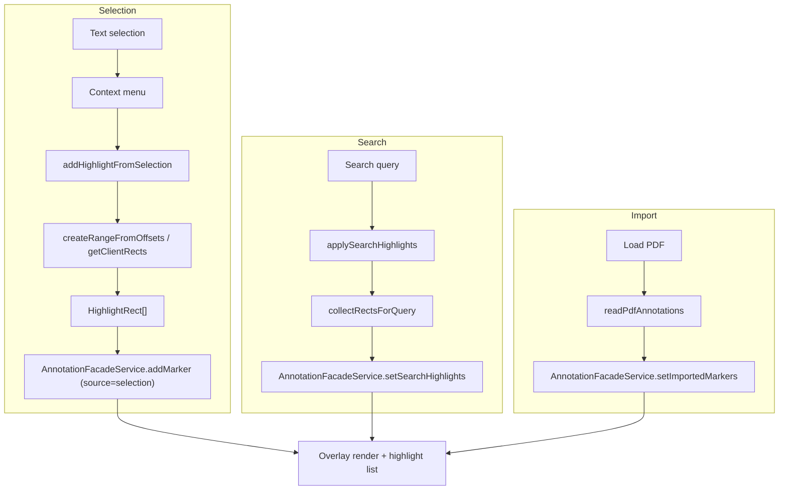

# ハイライト機能 仕様・設計（外部開発者向け）

対象: `pdf-viewer`（FR-06 選択テキストのハイライト / FR-05 検索結果ハイライト）  
主な実装: `src/app/pages/viewer-shell/viewer-shell.component.*`, `src/app/features/annotations/annotation-facade.service.ts`, `src/app/features/pdf/pdf-facade.service.ts`, `src/app/core/models.ts`

## 1. 概要（ハイライトの種類）
現在のハイライトは **Marker（矩形オーバーレイ）方式に統一** されています。  
テキストレイヤ DOM を `span` でラップする方式は廃止し、選択・検索ともに矩形の集合として描画します。

1) **選択範囲ハイライト（ユーザー操作）**  
選択範囲の DOM Range から `HighlightRect` を算出し、`Marker(source='selection')` として保存します。  
→ 範囲情報は矩形（%）のみを保持するため、ズーム後も見た目は維持されますが、再レンダリング時に「テキストへ再追従」はしません。

2) **検索結果ハイライト（自動）**  
検索結果の一致範囲を矩形化し `Marker(source='search')` で描画します。  
→ 検索結果は一覧には載らず、検索のたびに全ページ分を置き換えます。

3) **PDF 既存注釈のハイライト（インポート）**  
PDF 内の Highlight 注釈を読み込み、`origin='pdf'` の `Marker` として描画します（読み取り専用）。

補足:
- 比較機能の差分表示は `div.diff-highlight` による矩形描画で、`Marker` とは別管理です（FR-09 関連）。

### 1.1 簡易フロー（選択 / 検索 / インポート）

## 2. ユーザー仕様（UI/UX）

### 2.1 選択範囲ハイライト
- ページ上のテキストを選択 → 右クリック → 「選択範囲をハイライト」
- コンテキストメニューのスウォッチで色を選択（`--color-highlight-*`）
- 追加したハイライトは右サイドの一覧に表示され、削除可能（`origin='app'` のみ）
- `source='selection'` のハイライトはドラッグで移動可能（矩形の平行移動）

### 2.2 検索結果ハイライト
- サイドパネル「全文検索」で検索実行すると、ヒット箇所が自動ハイライトされる
- 検索ハイライトは「ハイライト一覧」には表示されない
- 新しい検索を実行すると既存の検索ハイライトは置き換えられる

### 2.3 PDF 注釈の読み込み / ダウンロード
- PDF 読み込み時に `readPdfAnnotations()` で既存ハイライト・コメントを取り込み表示
- PDF ダウンロード時に `annotatedDownload` が有効なら、`PdfAnnotationExport` に基づきハイライトとコメントを埋め込む

## 3. データモデル
型定義: `src/app/core/models.ts`

### 3.1 HighlightRect（矩形）
`HighlightRect` はページ上の矩形を **パーセンテージ（0..100）** で表現します。
- `left/top/width/height`: ページ DOMRect を基準に正規化した割合

### 3.2 Marker（矩形の集合 = ハイライトの描画単位）
`Marker` はハイライト矩形群とメタ情報のまとまりです。
- `id`: UI/操作用 ID
- `page`: ページ番号（1 始まり）
- `rects`: `HighlightRect[]`
- `color`: CSS color
- `label`: ラベル（任意、オンページのラベル表示に使用）
- `text?`: 選択テキスト等（一覧表示では `text` が優先）
- `source`: `'search' | 'selection'`
- `origin?`: `'app' | 'pdf'`（PDF 由来は読み取り専用）

### 3.3 PdfHighlightAnnotation（エクスポート用）
`PdfHighlightAnnotation` は PDF へ書き戻す際のハイライト定義です。
- `page/rects/color/contents` を `PdfAnnotationExport` にまとめます。

### 3.4 PageTextLayout（テキスト→矩形マッピング）
`PageTextLayout` は `.textLayer` から抽出した連結テキストと矩形の対応表です。
- `text`: TextNode を連結した文字列
- `spans`: `TextSpanRects[]`（start/end と `DOMRect[]`）

検索や差分計算で「(start,end) → rects」を求めるために利用します。

## 4. アーキテクチャ（責務分割）

### 4.1 状態: AnnotationFacadeService（Marker の保管）
実装: `src/app/features/annotations/annotation-facade.service.ts`

- `selectionHighlights`: ユーザー作成ハイライト（編集可能）
- `searchHighlights`: 検索結果ハイライト（検索ごとに置き換え）
- `importedMarkers`: PDF からの取り込み（読み取り専用）
- `userMarkers`: `selectionHighlights + importedMarkers`
- `allMarkers`: `searchHighlights` を含む全表示対象

`addMarker()` は `source` により `selectionHighlights` または `searchHighlights` を更新します。  
`markerCount` と一覧表示は `userMarkers` のみ対象です。

### 4.2 表示・計算: ViewerShellComponent
実装: `src/app/pages/viewer-shell/viewer-shell.component.ts` / `.html` / `.scss`

#### 4.2.1 テキストレイヤ参照とレイアウト取得
`(text-layer-rendered)` で `.textLayer` を解決し、`PageTextLayout` を生成して `textLayouts` に保持します。  
検索や差分ハイライトはこのレイアウトを優先使用し、未取得時は DOM を走査して補完します。

#### 4.2.2 選択範囲ハイライト（Range → rects）
- 右クリック時に選択範囲のオフセットとテキストを `contextMenu` に退避
- 追加時に `createRangeFromOffsets()` で Range を復元し、  
  `range.getClientRects()` から `HighlightRect[]` を算出
- `AnnotationFacadeService.addMarker(..., source='selection')` で保存

#### 4.2.3 検索結果ハイライト
`applySearchHighlights()` で `collectRectsForQuery()` を実行し、
- `PageTextLayout` があれば `indexOf` + `rectsFromOffsets()` で高速算出
- ない場合は `.textLayer` を TreeWalker で走査して Range を構築（フォールバック）

算出結果を `setSearchHighlights()` で一括反映します。

#### 4.2.4 描画と操作
- `.page-overlay` 上に `div.highlight` を配置して矩形を描画
- `label` がある場合は `div.highlight-label` を併置
- `source='selection'` かつ `origin='app'` のみドラッグ移動・削除可

### 4.3 PDF 注釈の入出力
実装: `src/app/features/pdf/pdf-facade.service.ts`

- `readPdfAnnotations()` で Highlight 注釈を `HighlightRect` に変換し `origin='pdf'` として登録
- `downloadCurrentPdf()` で `PdfAnnotationExport` を `pdf-lib` により PDF 注釈へ埋め込む

## 5. スタイル上の注意（視認性）
- ハイライトは `mix-blend-mode: multiply` と半透明で表示し、選択時は `--highlight-strong` を用いて強調します。
- `.textLayer { opacity: 1 !important }` に上書きし、テキストの視認性を担保しています。

## 6. フィーチャーフラグと表示制御
- `flags.markers=false`: ハイライト機能全体（描画・一覧・コンテキストメニュー）を無効化
- `flags.search=false`: 検索 UI と検索ハイライトを停止
- `flags.annotatedDownload=false`: PDF へのハイライト書き戻しを無効化
- `showObjects()`: オーバーレイ（ハイライト/コメント）の表示切替

## 7. 既知の制約と拡張ポイント
- **矩形ベースのため再追従しない**: 選択ハイライトは rects のみ保存するため、  
  PDF の回転やレイアウト変化で位置ずれが起きる可能性があります（必要なら offset 保存＋再計算方式へ）。
- **検索フォールバックのコスト**: `.textLayer` の TreeWalker 走査は大きなページで重くなるため、  
  `PageTextLayout` のキャッシュ維持が重要です。
- **ラベル/メタ情報の拡張**: `Marker.label` や `Marker.text` を UI 入力に拡張すれば、  
  ラベル編集・タグ付けなどに対応可能です。
