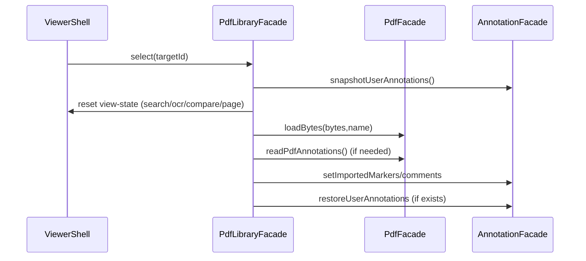

# 複数PDFライブラリ（キュー） 仕様・詳細設計

対象: `pdf-viewer` / `docs/planning/issues.md` 新規開発機能 **2. 複数PDFのアップロード（キュー/ライブラリ化）**  
関連: D&D取り込み（`docs/design/drag-drop-import-design.md`）、ページジャンプ（`docs/design/page-jump-design.md`）

---

## 1. ゴール/非ゴール

### ゴール
- アプリ内で「読み込み済みPDFのリスト」を保持する
- 一覧ダイアログから任意のPDFへ確実に切り替えられる
- ヘッダーの「前へ/次へ」で順番に切り替えられる
- 追加（ファイル選択 / D&D）時は末尾に追加し、原則そのPDFを選択状態にする
- 同一ファイル名は許容しつつ、UIで見分けられる手当をする

### 非ゴール（MVP）
- 永続化（リロード後も残す）、履歴管理
- 大量PDF（数百）を想定した最適化（仮想スクロール等）
- サムネイルの完全な事前生成（必要なタイミングで遅延生成）

---

## 2. 現状整理（前提）

現行は「単一PDF」を前提に以下の state を保持している。
- `PdfFacadeService`: 現在のPDF（`pdfDoc/pages/originalFileBytes/currentName` 等）
- `AnnotationFacadeService`: 注釈（ユーザー作成/検索/インポート）
- `ViewerShellComponent.resetFeatureStates()`: PDF読み込みごとに検索/OCR/比較/注釈等をリセット

複数PDF対応では「ドキュメントの切替」と「ビュー状態のリセット」を安全に分離する必要がある。

---

## 3. 状態設計

### 3.1 最低限の状態（要件）
- `items: PdfLibraryItem[]`
- `selectedId: string | null`

### 3.2 `PdfLibraryItem`（提案）
```ts
type PdfLibraryItem = {
  id: string;                 // UUID 推奨
  name: string;               // 元の file.name（表示や出力の基準）
  displayName: string;        // 重複対策を含むUI表示名
  bytes: ArrayBuffer;         // 原本（ダウンロード用に保持）
  addedAt: number;            // 追加時刻（デバッグ/並び替えに利用可）
  pageCount?: number;         // 取得できた場合
  thumbnailUrl?: string | null; // DataURL（失敗は null）
  annotations?: {
    userMarkers: Marker[];    // ユーザー作成ハイライト
    userComments: CommentCard[];
  };
  imported?: {
    markers: Marker[];        // PDF内注釈（読み取り専用）
    comments: CommentCard[];
  };
};
```

> 重要: `bytes` はメモリを使う。MVPは「ユーザーが読み込んだ分だけ保持」でよいが、上限/削除UI（将来拡張）も検討する。

### 3.3 ビュー状態（切替時にリセットするもの）
要件「切替時はビューアの状態をリセット」に従い、以下は **PDF切替ごとに初期化**する。
- スクロール位置/ページ入力（`docs/design/page-jump-design.md`）
- 検索クエリ/検索結果（`SearchFacadeService` / search highlights）
- OCR結果（`OcrFacadeService`）
- 比較対象（`CompareFacadeService`）
- 選択状態（selected marker/comment、コンテキストメニュー等）

一方で、以下は **ドキュメントに紐づく状態**として保持し、切替時に復元する。
- ユーザー作成の注釈（ハイライト/コメント）
- PDF内注釈の取り込み結果（インポート済み marker/comment）

---

## 4. アーキテクチャ提案

### 4.1 新規: `PdfLibraryFacadeService`（例: `src/app/features/library/pdf-library-facade.service.ts`）
責務:
- `PdfLibraryItem[]` の追加/選択/前後移動/削除（将来）を統括
- 切替時に「現在の注釈のスナップショット保存」と「選択先の注釈の復元」を行う

主なAPI案:
```ts
addFiles(files: File[]): Promise<void>;
select(id: string): Promise<void>;
selectNext(): Promise<void>;
selectPrev(): Promise<void>;
items(): PdfLibraryItem[];
selected(): PdfLibraryItem | null;
```

### 4.2 `PdfFacadeService` の拡張（推奨）
複数PDFでは「File入力」だけでなく「bytesから読み込み」を使いたい。

提案:
- `loadBytes(bytes: ArrayBuffer, name: string): Promise<void>` を追加
  - `loadFile(file)` は `file.arrayBuffer()` の後に `loadBytes(...)` を呼ぶ薄いラッパに寄せる

これにより、ライブラリ切替で `File` を再保持しなくてもよい（bytesは確実に残る）。

### 4.3 `AnnotationFacadeService` の拡張（推奨）
現状はユーザー注釈（selectionHighlights/comments）を「追加/更新」できるが、切替復元用の setter が無い。

提案:
- `snapshotUserAnnotations(): { userMarkers: Marker[]; userComments: CommentCard[] }`
- `restoreUserAnnotations(snapshot): void`

または setter を個別追加:
- `setUserMarkers(markers: Marker[]): void`
- `setUserComments(comments: CommentCard[]): void`

> Imported（PDF由来）は現行の `setImportedMarkers/setImportedComments` を使用する。

---

## 5. フロー設計

### 5.1 追加（ファイル選択/D&D）
1. `File[]` から **PDFのみ抽出**（type/拡張子）
2. `file.arrayBuffer()` で bytes を取得し `PdfLibraryItem` を生成
3. `items` 末尾へ追加
4. 原則、追加した item を `select()` して表示に反映

### 5.2 切替（select）
切替の基本フロー:
1. 現在選択中があれば、ユーザー注釈を `AnnotationFacadeService` からスナップショットして `items[current].annotations` に保存
2. `ViewerShellComponent.resetViewState()` 相当の **ビュー状態**をリセット（検索/OCR/比較/選択/スクロール等）
3. `PdfFacadeService.loadBytes(item.bytes, item.name)` でPDFを読み込む
4. PDF内注釈:
   - `items[item].imported` が未取得なら `pdf.readPdfAnnotations()` で取得して `items[item].imported` に保存
   - `AnnotationFacadeService.setImportedMarkers/comments` に反映
5. ユーザー注釈:
   - `items[item].annotations` があれば `restoreUserAnnotations` で復元
   - 無ければ空で初期化



---

## 6. UI設計（ヘッダー/一覧ダイアログ）

### 6.1 ヘッダー
追加ボタン（要件）:
- 「一覧」: ダイアログを開く
- 「前のPDF」「次のPDF」: `selectPrev/selectNext`（先頭/末尾は disabled）

配置:
- 既存の操作群（ズーム/オブジェクトONOFF/ダウンロード）の近くに追加する

キーボード（任意）:
- `Ctrl/Cmd + ←/→` で `prev/next`

### 6.2 一覧ダイアログ（モーダル）
要件: PDFカードをグリッド表示（レスポンシブ）

カードの最低限表示:
- サムネイル（`thumbnailUrl` / 無ければプレースホルダ）
- 表示名（省略 + `title` で全文）
- ページ数（取得できる場合）
- 選択中の視覚表現（枠/チェック）

操作:
- カードクリック: `select(id)` → ダイアログを閉じる
- 外側クリック/ESC: 閉じる

---

## 7. サムネイル設計（2-1-1）

### 7.1 生成タイミング（遅延生成推奨）
- 一覧ダイアログを開いたときに、`thumbnailUrl` 未生成の item だけ生成開始
- 生成中はスケルトンを表示

### 7.2 生成方式（案）
- `pdfjs-dist` で対象PDFの `page=1` を開き、小さな `scale` で `canvas` に描画
- `window.devicePixelRatio` を考慮して高DPI対応
- `canvas.toDataURL('image/png')` を `thumbnailUrl` として保存

### 7.3 キャッシュ
- `PdfLibraryItem.thumbnailUrl` をメモリに保持し再生成しない
- 失敗時は `null` を保存し、次回以降はアイコン表示へフォールバック

---

## 8. 同一ファイル名の扱い

要件: 重複は許容。必要なら補助情報付与。

提案（UI表示名の一意化）:
- 追加時に `displayName` を決める
  - 既存に同名が無ければそのまま
  - 既存にある場合は `name (2)`, `name (3)` … を付与

---

## 9. 受け入れ条件（`docs/planning/issues.md`対応）
- 一覧から任意のPDFへ確実に切り替えられる
- 現在選択中が明確に分かる
- 前/次で順序に従って切り替えられる（先頭/末尾は無効化）
- 切替時に検索/OCR/比較/スクロールなどのビュー状態が破綻せず初期化される
